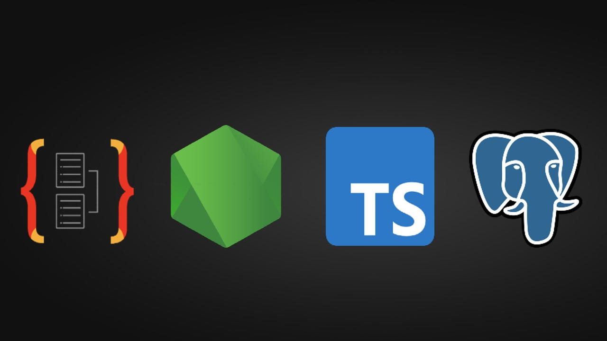

# Projeto Todo List - Processo Seletivo MosaicQ

<p align="center">
  
</p>

## Sobre o projeto

Este projeto faz parte do processo seletivo para a vaga de Desenvolvedor Back End Júnior na empresa MosaicQ. A aplicação consiste em um sistema para gerenciamento de tarefas, onde os usuários podem registrar tarefas com título, descrição, data de criação e status (pendente, em andamento ou concluída).

## Tecnologias Utilizadas

 - Node.js: Ambiente de execução JavaScript.
 - TypeScript: Linguagem de programação para desenvolvimento seguro e escalável.
 - TypeORM: ORM para manipulação de dados no banco de dados.
 - PostgreSQL: Banco de dados relacional para persistência dos dados.
 - Docker: Contêineres para facilitar a criação e compartilhamento do ambiente de desenvolvimento.
 - Vitest: Biblioteca para testes unitários e de integração.
 - Supertest: Biblioteca para simulação de requisições HTTP nos testes.

## Funcionalidades

 - Cadastro de tarefas com título, descrição, data de criação e status.
 - Persistência dos dados em um banco de dados PostgreSQL.
 - Documentação da API com Swagger.
 - Testes unitários e de integração para garantir a qualidade do código.

## Pré-requisitos

Para rodar o projeto, é necessário ter instalado na sua máquina:
 - Node.js (versão 18 ou superior)
 - Docker (versão 20 ou superior)

## Verificando as Instalações

### Node.js:

```bash
node --version
```

Caso não tenha o Node.js instalado, baixe e instale a partir do site oficial.

### Docker:

```bash
docker --version
```

Se o Docker não estiver instalado, acesse docker.com e siga as instruções para instalar o Docker Desktop.

## Como Executar o Projeto

1. ### Clone o repositório:

    ```bash
    git clone https://github.com/Leandrops2022/todo-list-mosaicq.git
    cd todo-list-mosaicq
    ```


2. ### Instale as dependências:

    ```bash
    npm install
    ```


3. ### Suba os contêineres com Docker Compose:

    ```bash
    docker compose build
    docker compose up
    ```


4. ### Aguarde de 5 a 10 segundos até que a mensagem abaixo apareça no terminal:

    ```bash
    Server is running on http://localhost:3000
    todo_app | Swagger docs available at http://localhost:3000/api-docs
    ```


5. ### Acesse a aplicação:

    A API estará disponível em: http://localhost:3000
    
    A documentação Swagger estará disponível em: http://localhost:3000/api-docs


## Testes
O projeto conta com testes unitários e de integração para validar o funcionamento das principais funcionalidades. Para executar os testes, utilize o seguinte comando:

```bash
npm run test
```

### Estrutura dos Testes

Os testes foram desenvolvidos utilizando Vitest e Supertest.

- Testes Unitários: Validam funções e métodos isolados.
- Testes de Integração: Validam a interação entre os componentes da aplicação, incluindo requisições HTTP.


## Estrutura do Projeto


## Licença
Este projeto está sob a licença MIT. Consulte o arquivo LICENSE para mais detalhes.

Desenvolvido por Leandro Pereira Soares

Contato: leandropereirasoares1987@gmail.com

LinkedIn: linkedin.com/in/leandro-soares-474762108

